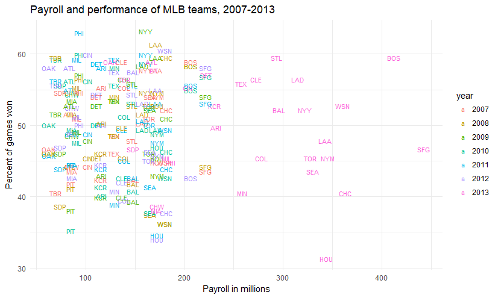
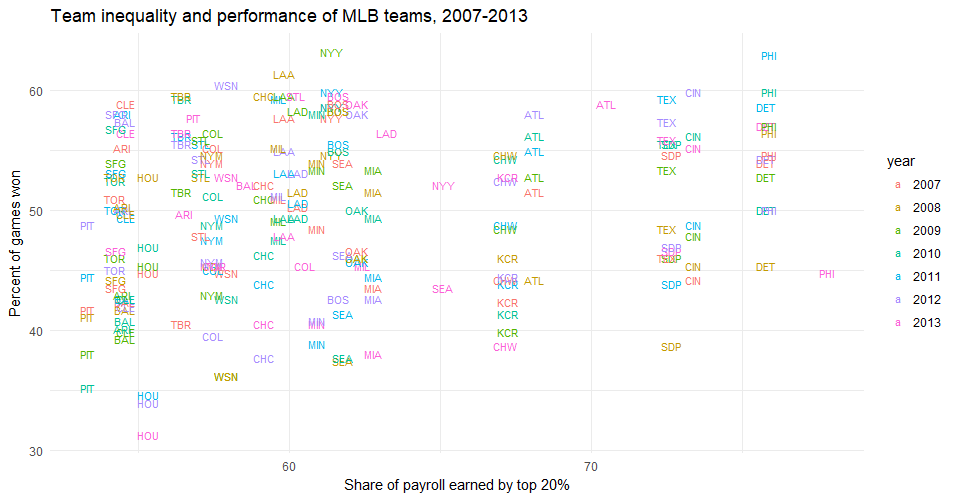
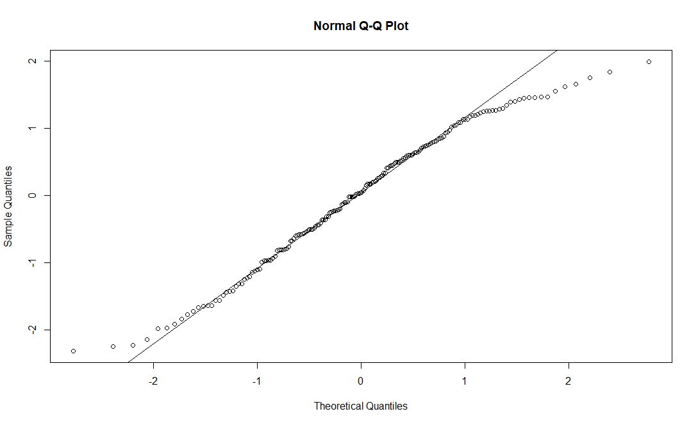

# Proyecto Final 

### Miguel Ángel Jiménez Abraham
    
En este trabajo, se presentan los ejercicios elaborados en *R* solicitados por el laboratorista. Se da una ligera explicación acerca del procedimiento y se muestran los códigos y resultados. Los ejercicios solicitados consistieron en replicar elaborar algunas preguntas de tareas en *R*, generar base de datos y replicar un modelo. A continuación se procede a mostrar los puntos solicitados para este proyecto:

1. Tarea 1
    1. Ejercicio 4. Replicar los ejercicios.
    2. Ejercicio 6. Replicar los ejercicios.

1. Tarea 2
    1. Ejercicio 5. Generar funciones para bmco, bmcr, Y y U.
    
1. Tarea 3
    1. Ejercicio 5. Generar una muestra para X, n = 100.
    1. Ejercicio 6. Generar una muestra para X, n = 200.
    
1. Replicar modelo con base en el artículo: " * Does pay inequality affect team performance?* " 

A partir de ahora se muestra lo elaborado para dicho proyecto.

####**Tarea 1**

**Ejercicio 4**

I. Este ejercicio consistió en calcular covarianzas, esperanzas y varianzas de algunas matrices dadas. Los valores proporcionados fueron los siguientes:

    Ex1=0
    Ex2=-4
    Ex3=1
    Ey1=-1
    Ey2=4

    varx1=1
    varx2=4
    varx3=2
    vary1=1
    vary2=9

    covx1x2=-1
    covx1x3=0
    covx1y1=0
    covx1y2=1

    covx2x3=2
    covx2y1=-1
    covx2y2=-3

    covx3y1=0
    covx3y2=3
    covy1y2=-2

*Código:*

    EX<-matrix(c(Ex1,Ex2,Ex3)) #Esperanza de X

*Resultado:*
    
    EX #Esperanza de X
         [,1]
    [1,]    0
    [2,]   -4
    [3,]    1

*Código:*

    VarX<-matrix(c(varx1,covx1x2,covx1x3,covx1x2,varx2,covx2x3,covx1x3,covx2x3,varx3),3) #Varianza de X

    VarY<-matrix(c(vary1,covy1y2,covy1y2,vary2),2) #Varianza de Y
    
    CovXY<-matrix(c(covx1y1,covx2y1,covx3y1,covx1y2,covx2y2,covx3y2),3) #Covarianza(X,Y)

    CovYX<-matrix(c(covx1y1,covx1y2,covx2y1,covx2y2,covx3y1,covx3y2),2) #Covarianza(Y,X)

*Resultado:*

    VarX #Varianza de X
         [,1] [,2] [,3]
    [1,]    1   -1    0
    [2,]   -1    4    2
    [3,]    0    2    2

    VarY #Varianza de Y
         [,1] [,2]
    [1,]    1   -2
    [2,]   -2    9

    CovXY #Covarianza de X, Y
         [,1] [,2]
    [1,]    0    1
    [2,]   -1   -3
    [3,]    0    3

    CovYX #Covarianza de Y, X
         [,1] [,2] [,3]
    [1,]    0   -1    0
    [2,]    1   -3    3

II. En este inciso se piden calcular algunas operaciones con esperanzas y varianzas de la forma AX, en donde A es un vector constante y X es un vector aleatorio.

  
*Código:*

    S<-matrix(c(-1,3/2,-4),1)
    ESX<-S%*%EX
    VarSX<-S%*%VarX%*%(t(S))
    
*Resultado:*
    
    ESX
         [,1]
    [1,]  -10

    VarSX
         [,1]
    [1,]   21   

III. En esta parte se propone calcular esperanzas y varianzas de una matriz de la forma AX+b donde A es una matriz constante, X es un vector aleatorio y b es un vector constante.

*Código:*

    A<-matrix(c(-2,1,0,4,1,-2),2)
    b<-matrix(c(1,1))

    EAX<-(A%*%EX)+b
    VarAX<-A%*%VarX%*%t(A)

*Resultado:*

    EAX
         [,1]
    [1,]    2
    [2,]  -17

    VarAX
         [,1] [,2]
    [1,]    6   10
    [2,]   10   33

IV. En esta sesión se propone calcular covarianzas, esperanzas y varianzas de una combinación lineal del vector X. Para realizar esto, la combinación lineal se expresó en la forma AX+b, como en el planteamiento del inciso anterior.

*Código:*

    U<-matrix(c(1,0,0,0,1,2,-3,0,3),3)
    u<-matrix(c(2,0,5))
    V<-matrix(c(1,-1,-1,4,1,-1),2)
    v<-matrix(c(1,0))

    EUX<-(U%*%EX)+u
    EVX<-(V%*%EX)+v

    VarUX<-U%*%VarX%*%t(U)
    VarVX<-V%*%VarX%*%t(V)

    CovUXV<-U%*%VarX%*%t(V)
    CovVXU<-V%*%VarX%*%t(U)

*Resultado:*

    EUX
         [,1]
    [1,]   -1
    [2,]   -4
    [3,]    0

    EVX
         [,1]
    [1,]    6
    [2,]  -17

    VarUX
         [,1] [,2] [,3]
    [1,]   19   -7  -32
    [2,]   -7    4   14
    [3,]  -32   14   58
    
    VarVX
         [,1] [,2]
    [1,]    5  -14
    [2,]  -14   59

    CovUXV
         [,1] [,2]
    [1,]    2  -23
    [2,]   -3   15
    [3,]   -6   48

    CovVXU
         [,1] [,2] [,3]
    [1,]    2   -3   -6
    [2,]  -23   15   48

V. En este parte se propone calcular la covarianza entre dos combinaciones lineales del vector aleatorio X (i.e Cov(AX+b,CX+d)).

*Código:*

    C<-matrix(c(-2,1,5),1)
    d<-8

    CovAXC<-A%*%VarX%*%t(C)

*Resultado:*

    CovAXC
         [,1]
    [1,]   18
    [2,]   37

*Código:*

    D<-matrix(c(1,2,4,0,-2,3),3)
    e<-matrix(c(1,0,-1))

    CovAXYD<-A%*%CovXY%*%t(D)

*Resultado:*

    CovAXYD
         [,1] [,2] [,3]
    [1,]    0   -2    3
    [2,]   -4   26  -67

VII. Parecido al inciso anterior.

*Código:*

    T<-matrix(c(-1,1,0,2,-4,0),2)
    t<-matrix(c(0,-1))

*Resultado:*

    VarTX
         [,1] [,2]
    [1,]   33  -15
    [2,]  -15   13

VIII. Parecido al inciso anterior.

*Código:*

    W<-matrix(c(-1,1,0,2,-4,0),2)
    w<-matrix(c(0,-1))
    Z<-matrix(c(1,0,1,1,1,-1),3)

    CovWXYZ<-W%*%CovXY%*%t(Z)
    CovZYXW<-Z%*%CovYX%*%t(W)

*Resultado:*

    CovWXYZ
         [,1] [,2] [,3]
    [1,]  -13  -13   13
    [2,]   -7   -5    3

    CovZYXW
         [,1] [,2]
    [1,]  -13   -7
    [2,]  -13   -5
    [3,]   13    3

**Ejercicio 6**

Este ejercicio consiste en encontrar valores esperados, covarianzas y varianzas a partir de vectores de medias y varianzas dadas..

I.

Código:

    EJ<-matrix(c(1,0,2))
    VarJ<-matrix(c(.8,0.4,-0.2,0.4,1,-0.8,-0.2,-0.8,2),3)

    K<-matrix(c(1,0,0),1)
    M<-matrix(c(0,0,1,0,0,1),2)

    VarK<-K%*%VarJ%*%t(K)
    VarM<-M%*%VarJ%*%t(M)
    CovKM<-K%*%VarJ%*%t(M)
    COvMK<-M%*%VarJ%*%t(K)
    

Resultado:

    VarK
         [,1]
    [1,]  0.8
    
    VarM
         [,1] [,2]
    [1,]  1.0 -0.8
    [2,] -0.8  2.0

    CovKM
         [,1] [,2]
    [1,]  0.4 -0.2

    COvMK
         [,1]
    [1,]  0.4
    [2,] -0.2

II.

Código:

    EKKt<-(K%*%VarJ%*%t(K))+(K%*%EJ%*%t(EJ)%*%t(K))
    EMMt<-(M%*%VarJ%*%t(M))+(M%*%EJ%*%t(EJ)%*%t(M))
    EMtM<-(matrix(c(0,1,0),1)%*%VarJ%*%t(matrix(c(0,1,0),1)))+(matrix(c(0,1,0),1)%*%EJ%*%t(EJ)%*%t(matrix(c(0,1,0),1)))+(matrix(c(0,0,1),1)%*%VarJ%*%t(matrix(c(0,0,1),1)))+(matrix(c(0,0,1),1)%*%EJ%*%t(EJ)%*%t(matrix(c(0,0,1),1)))
    EKMt<-(K%*%VarJ%*%t(M))+(K%*%EJ%*%t(EJ)%*%t(M))
    EMKt<-(M%*%VarJ%*%t(K))+(M%*%EJ%*%t(EJ)%*%t(K))

Resultado:

    EKKt
         [,1]
    [1,]  1.8

    EMMt
         [,1] [,2]
    [1,]  1.0 -0.8
    [2,] -0.8  6.0

    EMtM
         [,1]
    [1,]    7

    EKMt
         [,1] [,2]
    [1,]  0.4  1.8

    EMKt
         [,1]
    [1,]  0.4
    [2,]  1.8

####**Tarea 2**

**Ejercicio 5**

Esta parte consiste en generar funciones para bmco y bmcrm.

Código:

    n<-10 #Colocar número de observaciones.
    b<- #Colocar vector deverdaderos parámetros.
    U<- #Colocar el vector de U (media cero y homocedástica).
    Xj<- #Colocar la matriz de X (variables independientes).
    Constante<-matrix(rep(1,n),n)
    X<-cbind(Constante,Xj)
    R<- # Colocar matriz de restricciones.
    r<- #Colocar vector de resultados de las restricciones.

    bMCO = function(b,X,U){
      a<-b+(solve(t(X)%*%X)%*%t(X)%*%U)
      return(a)
    }

    bMCR = function(bMCO,X,R,r){
      b<-bMCO-((solve(t(X)%*%X))%*%t(R)%*%(solve(R%*%solve(t(X)%*%X)%*%t(R)))%*%((R%*%bMCO)-r))
      return(b)
    }

    bMCO<-a
    bMCR<-b
    
Este código está abierto a asumir cualquier distribución o forma ya que no se ha espeficado alguna condición de distribución en X o U,.

####**Tarea 3**

**Ejercicio 5**

Consiste en generar una muestra de X con n=100. Para realizar lo anterior, se usa la librería *mvtnorm*.

Código:

    library(mvtnorm)
    set.seed(100)

    Sigma1<-matrix(c(1,-.25,-.25,.5),2)
    Muestra1<-rmvnorm(100,mean=c(0,-1),sigma=Sigma1)

    Sigma2<-matrix(c(1,(1/3),-.5,(1/3),.25,0,-.5,0,1),3)
    Muestra2<-rmvnorm(100,mean=c(-2,0,-2),sigma=Sigma2)

**Ejercicio 6**

Consiste en generar una muestra de X con n=200 conforme a los datos indicados en la tarea.

Código:

    library(mvtnorm)
    set.seed(100)

    Sigma3<-matrix(c(1,0,1,0,0,9,0,1,1,0,4,0,0,1,0,9),4)
    Muestra3<-rmvnorm(200,mean=c(0,0,1,1),sigma=Sigma3)

####**Tarea 4**

**Ejercicio 4.6**

Esta actividad consiste en generar un vector de U. Después se pide obtener el estimador de MCO para una muestra de n=800.

Código:

    library(mvtnorm)
    set.seed(100)

    #Pregunta 5
    n<-10 #Colocar n observaciones.
    Mean<-rep(0,n) #Vector de medias.
    VarU<-1 #Colocar sigma cuadrada si se cumple homocedasticidad.
    Sigma4<-diag(VarU,n)
    U<-t(rmvnorm(1,mean=Mean,sigma=Sigma4))

    #Mínimos cuadrados ordinarios
    n1<-800
    Sigma5<-matrix(c(0.8,0.4,-0.2,0.4,1,-0.8,-0.2,-0.8,2),3) 
    Muestra<-rmvnorm(n1,mean=c(1,0,2),sigma=Sigma5)

    Y<-Muestra[,1]
    Xj<-Muestra[,2:3]
    Constante<-matrix(rep(1,n1),n1)
    X<-cbind(Constante,Xj)
    bMCO<-(solve(t(X)%*%X))%*%(t(X)%*%Y)

####**Artículo: Does pay inequality affect team performance?**

Se replica el ejercicio realizado en clase por el laboratorista, referente aun artículo previo publicado en <http://rpubs.com/dvorakt/183866> pero ahora considerando los años 2007-2013.

Las librerías usadas para este modelo son enlistadas a continuación. 

* library(XML)
* library(dplyr)
* library(tidyr)
* library(httr)
* library(ggplot2)
* library(stargazer)

Primero se leen los datos de la pag <http://www.usatoday.com/sports/mlb/salaries/2007/player/all/#card_full_width_main> y se generan bases de datos por año:

    #1. Creando la base de datos.

    sal2007 <- GET("http://www.usatoday.com/sports/mlb/salaries/2007/player/all/#card_full_width_main")
    sal2007 <- readHTMLTable(rawToChar(sal2007$content))[[1]]

    sal2008 <- GET("http://www.usatoday.com/sports/mlb/salaries/2008/player/all/#card_full_width_main")
    sal2008 <- readHTMLTable(rawToChar(sal2008$content))[[1]]

    sal2009 <- GET("http://www.usatoday.com/sports/mlb/salaries/2009/player/all/#card_full_width_main")
    sal2009 <- readHTMLTable(rawToChar(sal2009$content))[[1]]

    sal2010 <- GET("http://www.usatoday.com/sports/mlb/salaries/201/player/all/#card_full_width_main")
    sal2010 <- readHTMLTable(rawToChar(sal2010$content))[[1]]

    sal2011 <- GET("http://www.usatoday.com/sports/mlb/salaries/2011/player/all/#card_full_width_main")
    sal2011 <- readHTMLTable(rawToChar(sal2011$content))[[1]]

    sal2012 <- GET("http://www.usatoday.com/sports/mlb/salaries/2012/player/all/#card_full_width_main")
    sal2012 <- readHTMLTable(rawToChar(sal2012$content))[[1]]

    sal2013 <- GET("http://www.usatoday.com/sports/mlb/salaries/2013/player/all/#card_full_width_main")
    sal2013 <- readHTMLTable(rawToChar(sal2013$content))[[1]]

Se genera la variable año y se asigna a cada base de datos

    sal2007$year <- 2007
    sal2008$year <- 2008
    sal2009$year <- 2009
    sal2010$year <- 2010
    sal2011$year <- 2011
    sal2012$year <- 2012
    sal2013$year <- 2013

Luego se unen las bases de datos y se exporta como archivo **.csv*.

    salaries <- bind_rows(sal2013,sal2012,sal2011,sal2010,sal2009,sal2008,sal2007,sal2006)
    salaries <- select(salaries, -rank)

    write.csv(salaries, "salaries.csv", row.names = FALSE)

Luego se procesa la bases de datos exportada.

    # Procesando base de datos.
    salaries <- read.csv("salaries.csv")

    salaries <- select(salaries, year, Salary, Name, Team)
    str(salaries)
    salaries$Salary <- as.numeric(gsub("[[:punct:]]","",salaries$Salary))
    summary(salaries$Salary)

    # Eliminando ceros

    salaries <- arrange(salaries, Salary)
    head(salaries, n=5)
    tail(salaries, n=5)

    salaries <- filter(salaries, Salary != 0)
    salaries <- arrange(salaries, Salary)
    head(salaries, n=5)

Ahora se agrupan los datos.

    # Agrupando datos

    # Se acomodan por quintiles
    salaries <- salaries %>% group_by(year, Team ) %>% mutate(payroll=sum(Salary), pctile=ntile(Salary,5))
    salaries <- arrange(salaries, Salary)
    head(salaries, n=3)

    # Quintil más alto
    salaries <- filter(salaries, pctile==5)
    salaries <- arrange(salaries, Salary)
    head(salaries, n=3)

    # Procesando datos agregados.
    salaries <- salaries %>% group_by(year, Team, payroll) %>% summarize(top20=sum(Salary))
    salaries$top20share <- salaries$top20/salaries$payroll*100 

Ponemos el salario en millones y ordenamos "arrange"

    salaries$payroll <- salaries$payroll/1000000
    summary(salaries)

    salaries <- arrange(salaries, top20share)
    head(salaries, n=3)
    tail(salaries, n=3)

    # Variable Team en string
    salaries$Team <- as.character(salaries$Team)

Construir base de datos para partidos ganados. Fuente: <http://www.baseball-reference.com/leagues/MLB/#teams_team_wins3000::none>

    teamwins <- GET("http://www.baseball-reference.com/leagues/MLB/#teams_team_wins3000::none")
    teamwins <- readHTMLTable(rawToChar(teamwins$content), stringsAsFactors = FALSE)[[1]]

    write.csv(teamwins, "teamwins.csv", row.names = FALSE)
    teamwins <- read.csv("teamwins.csv",stringsAsFactors = FALSE)

    # Filtrando segunda base de datos.
    teamwins$Year <- as.numeric(teamwins$Year)
    teamwins <- filter(teamwins, !is.na(teamwins$Year))

    #Datos entre 2005 y 2010
    teamwins <- filter(teamwins, Year>2006 & Year<2014)

Reacomodamos los datos

    # Reacomodando los datos

    # Primero generamos una variable year_games que colapsa años y juegos
    teamwins <- unite(teamwins, year_games, Year, G)

    # Usamos gather para colapsar columnas de wins por cada team

    teamwins2 <- gather(data=teamwins, value=wins, key=team, ARI,ATL,BLA,BAL,BOS,CHC,CHW,CIN,CLE,COL,DET,HOU,KCR,LAA,LAD,MIA,MIL,MIN,NYM,NYY,OAK,PHI,PIT,SDP,SFG,SEA,STL,TBR,TEX,TOR,WSN)
    head(teamwins2)

    # Nuevamente separamos años y juegos
    teamwins2 <- separate(teamwins2,year_games, c("year", "games"))
    head(teamwins2)

    # Convertir algunas variables a numéricas
    teamwins2$games <- as.numeric(teamwins2$games)
    teamwins2$wins <- as.numeric(teamwins2$wins)
    teamwins2$year <- as.numeric(teamwins2$year)

    # Obtenemos el porcentaje de ganados
    teamwins2$pctwin <- teamwins2$wins/teamwins2$games*100
    teamwins2 <- arrange(teamwins2,pctwin)

    # Estadísticos y clasificación
    summary(teamwins2)
    head(teamwins2)
    tail(teamwins2)

    #Eliminando NA
    teamwins2 <- filter(teamwins2, !is.na(pctwin))
    tail(teamwins2)    

Antes de hacer merge con las bases, se homologa los códigos:
    
    # Uniendo base de datos

    #Homologación de códigos
    salaries$Team[salaries$Team=="SF"] = "SFG"
    salaries$Team[salaries$Team=="KC"] = "KCR"
    salaries$Team[salaries$Team=="SD"] = "SDP"
    salaries$Team[salaries$Team=="TB"] = "TBR"
    salaries$Team[salaries$Team=="WSH"] = "WSN"
    salaries$Team[salaries$Team=="CWS"] = "CHW"

    # Homologar nombre de la columna a Team
    teamwins2$Team <- as.character(teamwins2$team)
    teamwins2 <- select(teamwins2, -team)

    # Uniendo por year y Team.
    merged <- inner_join(teamwins2, salaries,by=c("year", "Team"))
    summary(merged)

    write.csv(merged, "database2005_2010.csv", row.names = FALSE)

Se gráfican los siguiente datos:

    library(ggplot2)
    ggplot(data=merged, aes(x=payroll,y=pctwin, label=Team, color=as.factor(year)))+ geom_text(size=3) +
      ggtitle("Payroll and performance of MLB teams, 2007-2013") + 
      xlab("Payroll in millions") + ylab("Percent of games won") +
      scale_color_discrete(name="year") + theme_minimal()

Y se obtiene:

De esta gráfica se tiene la siguiente conclusión: un mayor payroll no asegura tener mayor porcentaje de partidos ganados. Por ejemplo: los equipos PHI (azul) y NYY (verde) son los equipos con mayor porcentaje de partidos ganados pero se caracterizan por no contar con un alto payroll. En cambio, equipos como BOS y SFG son los equipos con mayor payroll pero no son los equipos con mayor porcentaje de partidos ganados.

Se elabora la siguiente gráfica:

    ggplot(data=merged, aes(x=top20share,y=pctwin, label=Team, color=as.factor(year))) + geom_text(size=3) +
      ggtitle("Team inequality and performance of MLB teams, 2007-2013") + 
      xlab("Share of payroll earned by top 20%") + ylab("Percent of games won") +
      scale_color_discrete(name="year") + theme_minimal()
      
Tenemos:

Para esta gráfica, la concentración del ingreso en el primer quintil no está relacionado para este periodo con el porcentaje de partidos ganados. Por ejemplo, equipos como NYY (verde) y PHI (azul) tienen un menor desigualdad en la distribución del payroll y tienen un mayor porcentaje de partidos ganados. Ante esto, parece que una mejor opción para los equipos es tratar de tener equipo con una distribución más estable del payroll.

Finalmente, se realizan las regresiones.

    library(stargazer)

    # El paquete stargazer crea tablas para html, latex i ascii bien formateadas.
    m1 <- lm(pctwin ~ top20share, data=merged) #Regresion (Y-X, Database)
    m2 <- lm(pctwin ~ top20share + payroll, data=merged)
    m3 <- lm(pctwin ~ top20share + log(payroll) , data=merged)

    stargazer(m1,m2,m3, type="text")
    
Se obtienen los siguientes resultados:

    ======================================================================================
                                               Dependent variable:                        
                        ------------------------------------------------------------------
                                                      pctwin                              
                                 (1)                    (2)                   (3)         
    --------------------------------------------------------------------------------------
    top20share                 0.196***              0.204***              0.209***       
                               (0.069)                (0.071)               (0.072)       

    payroll                                            0.003                              
                                                      (0.007)                             

    log(payroll)                                                             0.744        
                                                                            (1.162)       

    Constant                  37.716***              36.737***             33.207***      
                               (4.277)                (4.827)               (8.240)       

    --------------------------------------------------------------------------------------
    Observations                 210                    210                   210         
    R2                          0.038                  0.038                 0.039        
    Adjusted R2                 0.033                  0.029                 0.030        
    Residual Std. Error    6.702 (df = 208)      6.715 (df = 207)      6.712 (df = 207)   
    F Statistic         8.105*** (df = 1; 208) 4.134** (df = 2; 207) 4.246** (df = 2; 207)
    ======================================================================================
    Note:                                                      *p<0.1; **p<0.05; ***p<0.01

Además se realiza la prueba de normalidad para el primer modelo.

Se puede observar que los residuales no cumplen con la hipótesis de normalidad.

De acuerdo a la tabla anterior, se puede observar que los parámetros para el primero modelo son estadísticamente significativos. En cambio, en el segundo y último modelo, las variables *payroll* y *log(payroll)* son estadíticamente no significativos, respectivamente. Los R2 resultaron con valores bajos. Los estadísticos F resultaron estadísticamente significativos al nivel de significancia de 0.01, 0.01, 0,05 y 0.01. 

En cuanto a los parámetros de los modelos se puede decir lo siguiente: en el modelo uno, el cambio en *top20share* durante el periodo estuvo asociado a un cambio positivo en el porcentaje de partidos ganados. En cambio, en los demás modelos a pesar de que agregan más variables, éstas no muestran significancia estadística. Por lo tanto, los modelos 2 y 3 pueden reducirse a modelos explicados por la variable *top20share*. 

Por lo anterior, se debería buscar algunas otras variables que puedan explicar mejor el porcentaje de partidos ganados.