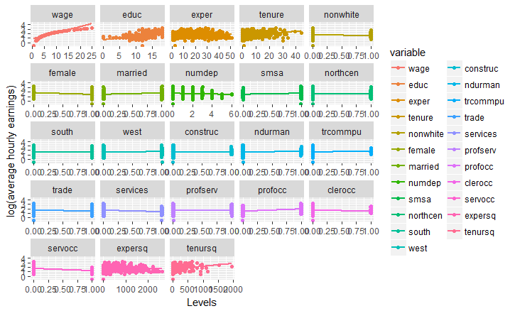
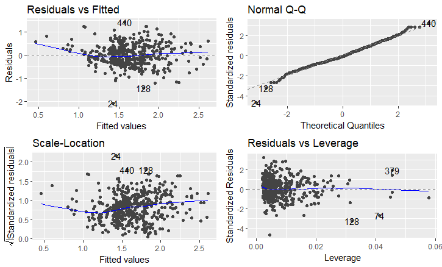
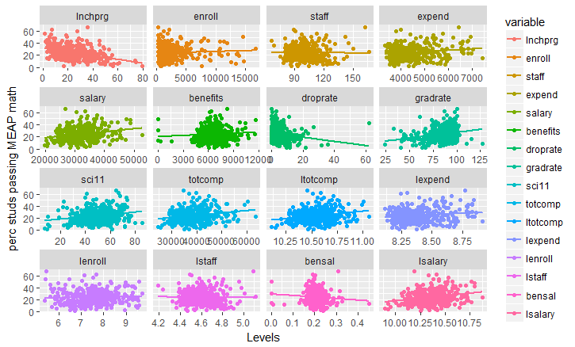
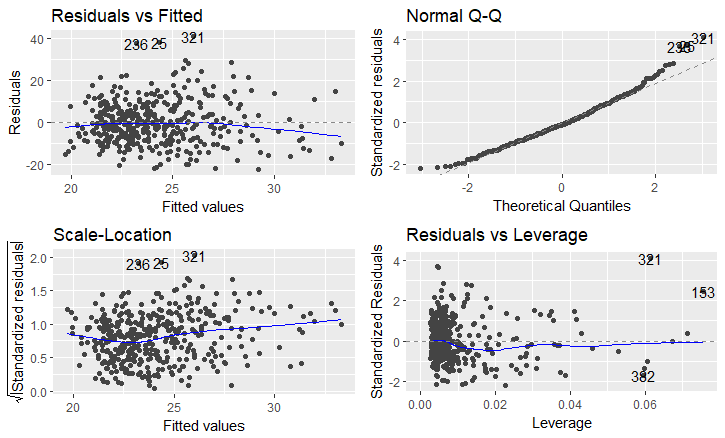

# Notas de sesión cinco de R.

En la sesión de resolvieron algunos problemas del laboratorio 14 de la matería. Los cuales se presentan a continuación.

## *Ejercicio 14.4*
Usando los datos en wage.xls y la información en WAGE1_description de Wooldridge, J.M. Introductory Econometrics: A Modern Approach. 5th Edition. Se quiere saber si a más años de experiencia laboral corresponde un mejor salario.

Para ello primero se cargo la base de datos a utilizarse, además se crearon una seríe de variables con dicha base:

    load("wage1.RData")
    library("stats")
    wage = matrix(data$wage)
    educ = matrix(data$educ)
    exper = matrix(data$exper)
    tenure = matrix(data$tenure)
    lwage = log(wage)
    n = nrow(wage)

Posteriormente se creo la matriz de variables explicativas, diseñada como se ha hecho en clases:

    unos = matrix(1, nrow = n, ncol=1) # Vector de unos 
    X = matrix(c(unos, educ, exper, tenure),n)
    k = ncol(X) 
    gl = n-k

Se cargó el paquete reshape2 para poder crear una nueva base de datos con la función melt(), la cual a groso modo permite agrupar la base de datos por la variable math10 y poniendo como variable indice el resto de información, así como su nivel.

    require(reshape2)
    library(reshape2)
    summary(data2)
    data2 = melt(data, id.vars='lwage')

Posteriormente se graficó dicha base, para poder ver las tendencias en los datos de lwage, con el resto de variables:

De donde quedó en evidencía la relación entre las variables, educ, expert y tenure que serían las variables con las que se trabajaría.
Así tambien, se marco la importancia de analizar los datos antes de correr los datos en una regresión lineal, debidó a que se podrían validar relaciones no importantes como en las variables south o west donde la tendencia positiva puede ser capturada cuando la existencia de ella es incierta.

Posteriormente se llevó a cabo la regresión, obteniendo lo siguiente:

    reg0 = lm(lwage ~ educ + exper + tenure)
    Call:
    lm(formula = lwage ~ educ + exper + tenure)

    Residuals:
         Min       1Q   Median       3Q      Max 
    -2.05802 -0.29645 -0.03265  0.28788  1.42809 

    Coefficients:
                Estimate Std. Error t value Pr(>|t|)    
    (Intercept) 0.284360   0.104190   2.729  0.00656 ** 
    educ        0.092029   0.007330  12.555  < 2e-16 ***
    exper       0.004121   0.001723   2.391  0.01714 *  
    tenure      0.022067   0.003094   7.133 3.29e-12 ***
    ---
    Signif. codes:  0 ‘***’ 0.001 ‘**’ 0.01 ‘*’ 0.05 ‘.’ 0.1 ‘ ’ 1

    Residual standard error: 0.4409 on 522 degrees of freedom
    Multiple R-squared:  0.316,	Adjusted R-squared:  0.3121 
    F-statistic: 80.39 on 3 and 522 DF,  p-value: < 2.2e-16

Para provar si, es que los residuales siguen el supuesto de normalidad, se utilizaron los paquetes ggfortify() y gvlma(), los cuales permitieron graficar los residuales de la regresión para verificar desviaciones a los supuestos de normalidad y hacer un test de curtosis, sesgo y heterosedasticidad de los residuales.

    require(ggfortify)
    require(gvlma)
    autoplot(reg0)

De esta grafica, es claro que el en grafico cuantil-cuantil de la distribución normal existe cierta desviación en las colas de la distribución, así como una tendencia creciente en la varianza de los residuos que pudiera provocar problemas para mantener los supuestos clasicos, para verificarlo se hizo el siguiente test:

    > gvlma(reg0)

    Call:
    lm(formula = lwage ~ educ + exper + tenure)

    Coefficients:
    (Intercept)         educ        exper       tenure  
       0.284360     0.092029     0.004121     0.022067  

    ASSESSMENT OF THE LINEAR MODEL ASSUMPTIONS
    USING THE GLOBAL TEST ON 4 DEGREES-OF-FREEDOM:
    Level of Significance =  0.05 

    Call:
     gvlma(x = reg0) 

                          Value   p-value                   Decision
    Global Stat        33.39687 9.906e-07 Assumptions NOT satisfied!
    Skewness            0.03952 8.424e-01    Assumptions acceptable.
    Kurtosis           20.90171 4.835e-06 Assumptions NOT satisfied!
    Link Function       6.72841 9.489e-03 Assumptions NOT satisfied!
    Heteroscedasticity  5.72723 1.670e-02 Assumptions NOT satisfied!
    
Por tanto, los residuales se comportan bien al rechazar las hipotesis nula de existencia de heterosedadticidad y aceptar la hipotesis de simetria en su distribución.

Posteriormente de elaboraron las pruebas de hipotesis de algunos de los parametros de la regresión lineal. para lo cual se calculó la varianza muestral de las perturbaciones aleatorias y los parametros de cada uno de los parametros del modelo por la vía usual.

    varu = var(reg0$residuals)
    betagorro = matrix(c(reg0$coefficients[1],reg0$coefficients[2],reg0$coefficients[3],reg0$coefficients[4]),4) #Coeficientes estimados
    b0 = betagorro[1]
    b1 = betagorro[2]
    b2 = betagorro[3]
    b3 = betagorro[4]

Las pruebas de hipotesis se hicieron a un nivel de significancia del 1% y 5%, para ambas colas, así se definió lo siguiente:

    alpha1 = 0.05;
    alpha2 = 0.01;
    level1 = 1-(alpha1/2)
    level2 = 1-(alpha2/2)

Y dado que la prueba era H0:b2=0.

    H0b2 = 0;
    H0b2text = "b2=0"  # Texto de de la hipótesis nula 

Se definío el estadistico T, asociado al estimador asociado.

    t2 = (b2 - H0b2)/(sqrt(varu)*sqrt(solve(t(X)%*%X)[3,3])) ##OJO [3,3]

Se realizó la prueba considerando como región de rechazo si el valor absoluto de t calculado fuera mayor al valor t de tablas al nivel de significancia 5%.

    if(abs(t2) > qt(level1,gl)){sprintf("Se rechaza H0: %s con %s de nivel de significancia", H0b2text, alpha1)} else {
        sprintf("Se acepta H0: %s con %s de nivel de significancia", H0b2text, alpha1)
      }
    [1] "Se rechaza H0: b2=0 con 0.05 de nivel de significancia"

Y lo mismo con el 1%.

    > if(abs(t2) > qt(level2,gl)){sprintf("Se rechaza H0: %s con %s de nivel de significancia", H0b2text, alpha2)} else {
    +   
    +   sprintf("Se acepta H0: %s con %s de nivel de significancia", H0b2text, alpha2)
    +   
    + }
    [1] "Se acepta H0: b2=0 con 0.01 de nivel de significancia"

Concluyendo que al disminuir el nivel de significancia del 5% al 1%, el intervalo de confianza se reduce, es decir se hace más compacto, por tanto existen más posibilidades de rechazar la hipotesis nula.

## *Ejercicio 14.5.1*

Lllevando a cabo un procedimiento similar al anterior, se realizó una base y se estrajeron las variables importantes, además de crear una base con variables indice.

    load("meap93.RData")
    library("stats")
    math10 = matrix(data$math10)
    totcomp = matrix(data$totcomp)
    staff = matrix(data$staff)
    enroll = matrix(data$enroll)
    n = nrow(math10)
    unos = matrix(1, nrow = n, ncol=1) # Vector de unos 
    X = matrix(c(unos, totcomp, staff, enroll),n)
    k = ncol(X)
    gl = n-k

Posteriormente, se realizó la regresión siguiente:

    reg1 = lm(math10 ~ totcomp + staff + enroll)
    summary(reg1)

    Call:
    lm(formula = math10 ~ totcomp + staff + enroll)

    Residuals:
        Min      1Q  Median      3Q     Max 
    -22.235  -7.008  -0.807   6.097  40.689 

    Coefficients:
                  Estimate Std. Error t value Pr(>|t|)    
    (Intercept)  2.2740209  6.1137938   0.372    0.710    
    totcomp      0.0004586  0.0001004   4.570 6.49e-06 ***
    staff        0.0479199  0.0398140   1.204    0.229    
    enroll      -0.0001976  0.0002152  -0.918    0.359    
    ---
    Signif. codes:  0 ‘***’ 0.001 ‘**’ 0.01 ‘*’ 0.05 ‘.’ 0.1 ‘ ’ 1

    Residual standard error: 10.24 on 404 degrees of freedom
    Multiple R-squared:  0.05406,	Adjusted R-squared:  0.04704 
    F-statistic: 7.697 on 3 and 404 DF,  p-value: 5.179e-05

De donde se puede notar que solo resulta significativo el efecto de totcomp sobre el porcentaje de pasados en matematicas, siendo el resto poco significativo.

Además se hizo un graficó de tendencias de la variable math10 con el resto de variables explicativas, obteniendo lo siguiente:

    > data2 = melt(data, id.vars='math10')
    > ggplot(data2) + geom_jitter(aes(value,math10, colour=variable),) + geom_smooth(aes(value,math10, colour=variable), method=lm, se=FALSE) + facet_wrap(~variable, scales="free_x")+labs(x = "Levels", y = "perc studs passing MEAP math")

Donde se percibió una gran conglomeración de la información en pequeños intervalos de la variable dependiente, hecho que podría indicar que el logaritmo de las variables independientes podría ser un mejor predictor.

Para provarlo se analizaron los residuales de la regresión sin ellos, en un primer momento de forma visual mediante graficos y posteriormente de forma estadistica mediante test de curtosis, simetria y heterocedasticidad.

En siguiente graficó, es claro que existe una mayor distancia al comportamiento usual de los residuales si estos cumplieran el supuesto de normalidad, dadp que presentan una varianza variable y una desviación de las colas en la distribución.

Lo que se puede distinguir como una señal de violación de los supuestos. Para verificarlos se hicieron las siguientes pruebas:

    > gvlma(reg1)

    Call:
    lm(formula = math10 ~ totcomp + staff + enroll)

    Coefficients:
    (Intercept)      totcomp        staff       enroll  
      2.2740209    0.0004586    0.0479199   -0.0001976  

    ASSESSMENT OF THE LINEAR MODEL ASSUMPTIONS
    USING THE GLOBAL TEST ON 4 DEGREES-OF-FREEDOM:
    Level of Significance =  0.05 

    Call:
     gvlma(x = reg1) 

                          Value   p-value                   Decision
    Global Stat        45.55544 3.047e-09 Assumptions NOT satisfied!
    Skewness           25.72251 3.942e-07 Assumptions NOT satisfied!
    Kurtosis           14.90501 1.131e-04 Assumptions NOT satisfied!
    Link Function       4.86669 2.738e-02 Assumptions NOT satisfied!
    Heteroscedasticity  0.06123 8.046e-01    Assumptions acceptable.

Por tanto, se demuestra con los datos disponibles que los residuales no presentan una distribución simetrica ni con homocedasticidad. Por tanto es de esperar una violación de los supuestos del modelo.
Por tanto los estimadores estaran sesgados.

Realizando las pruebas de hipotesis como en el anterior ejercicio: se obtiene que.

    > varu = var(reg1$residuals)
    > betagorro = matrix(c(reg1$coefficients[1],reg1$coefficients[2],reg1$coefficients[3],reg1$coefficients[4]),4) #Coeficientes estimados
    > b0 = betagorro[1]
    > b1 = betagorro[2]
    > b2 = betagorro[3]
    > b3 = betagorro[4]

Hipotesis nulas, para pruebas simples
 
    > alpha2 = 0.01;
    > alpha3 = 0.05;
    > level2 = 1- alpha2
    > level3 = 1- alpha3
    > H0b2 = 0;
    > H0b3 = 0;
    > H0b2text = "b2=0"  # Texto de de la hipótesis nula 
    > H0b3text = "b3=0"  # Texto de de la hipótesis nula 

Estadisticos para pruebas simples
 
    > t1 = (b1 - H0b1)/(sqrt(varu)*sqrt(solve(t(X)%*%X)[1,1]))
    Error: object 'H0b1' not found
    > t2 = (b2 - H0b2)/(sqrt(varu)*sqrt(solve(t(X)%*%X)[3,3])) #OJO 3,3 
    > t3 = (b3 - H0b3)/(sqrt(varu)*sqrt(solve(t(X)%*%X)[4,4])) #OJO 4,4

Pruebas de hipótesis simples

    > if(abs(t2) > qt(level2,gl)){sprintf("Se rechaza H0: %s con %s de nivel de significancia", H0b2text, alpha2)} else {
    +   
    +   sprintf("Se acepta H0: %s con %s de nivel de significancia", H0b2text, alpha2)
    +   
    + }
    [1] "Se acepta H0: b2=0 con 0.01 de nivel de significancia"

    > if(abs(t3) > qt(level3,gl)){sprintf("Se rechaza H0: %s con %s de nivel de significancia", H0b3text, alpha3)} else {
    +   
    +   sprintf("Se acepta H0: %s con %s de nivel de significancia", H0b3text, alpha3)
    +   
    + }

    [1] "Se acepta H0: b3=0 con 0.05 de nivel de significancia"