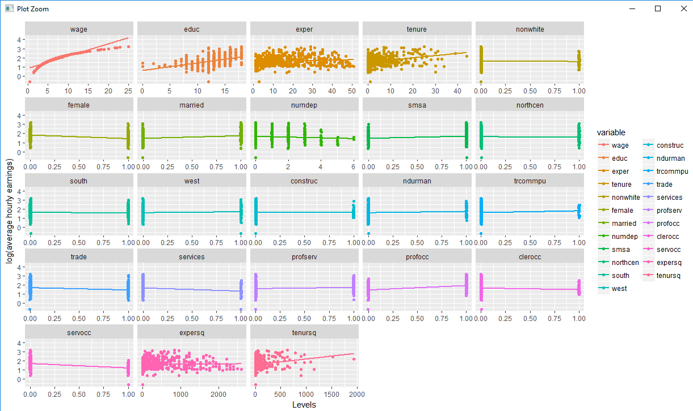
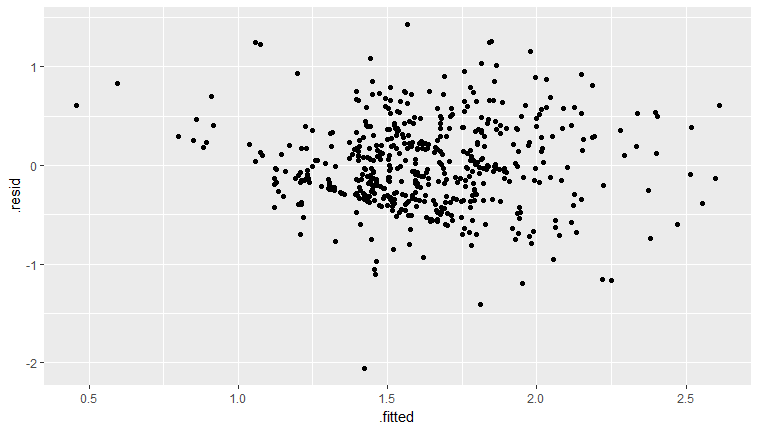
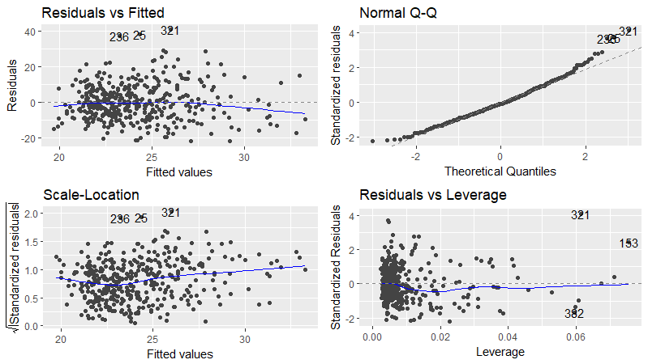

# Sesion 4 R: Regresiones y Pruebas de hipotesis
    
Esta fue la última sesión de R, y revisamos de forma realizar regresiones, la interpretación y validación.
Se explicó la clara diferencia entre correlación y causalidad.
La causalidad depende de la forma en que se obtienen los datos. No todas las regresiones pueden interpretarse de forma causal. 

Algunas de las actividades que realizamos, utilizando el código que nos proporcionó Humberto, junto con las bases de datos de wooldrige fueron:

## Instalar/cargar librerías

Algunas librerías que ocupamos:

- install.packages("dplyr")
- install.packages("tidyr")
- install.packages("R")
- library("stats")
- require(ggplot2)
- require(reshape2)

 
## Realizar una regresión 

Crear las variables sobre las que se realizara la regresión como matrices, se genera columna de unos necesaria para la regresión.

Código:

    load("wage1.RData")
    library("stats")

    wage = matrix(data$wage)
    educ = matrix(data$educ)
    exper = matrix(data$exper)
    tenure = matrix(data$tenure)

    lwage = log(wage)

    n = nrow(wage)

    unos = matrix(1, nrow = n, ncol=1) # Vector de unos 

    X = matrix(c(unos, educ, exper, tenure),n)
    k = ncol(X)

Se determinan los grados de libertad correspondientes a la muestra de datos, relevante para obtener los valores de las distribuciones para las pruebas de hipotesis.
Código:

    gl = n-k

### Resaltamos la importancia de graficar los datos

Es importante graficar los datos antes de obtener la regresion para verificar si tiene sentido hacer las regresiones sobre las variables.

Para ello podemos usar la librería **ggplot2** y apoyandonos de la librería **reshape2** con el comando **melt**

El comado *melt* nos permite graficar de manera rápida.
Repite las columnas hacia abajo mnateniendo la de interés de forma constante.

Código:

    ## Para graficar y ver las variables
    require(ggplot2)
    require(reshape2)
    data2 = melt(data, id.vars='lwage') #requiere reshape
    #melt repite columna lwage, sus valores, genera la columna identificador y pega el resto de lso valores
    ggplot(data2) + geom_jitter(aes(value,lwage, colour=variable),) + geom_smooth(aes(value,lwage, colour=variable), method=lm, se=FALSE) + facet_wrap(~variable, scales="free_x")+labs(x = "Levels", y = "log(average hourly earnings)")
    ##
    ###Verificar observacion de datos para ver si hay significado de la regresion
    #Evitar espuria

Para que puedan poner imágenes que tengan en su carpeta:

Se observa que algunas variables que se acumulan en los extremos de los graficos no tendran sentido utilizarlos para realizar la regresión. Solo aquellos dispersos, son los mejores candidatos como variables.

### Haciendo la regresion

Podemos ocupar el comando lm con lsa variables de interes:

Código:

    #Hacer regresion solicitada
    reg0 = lm(lwage ~ educ + exper + tenure)
    reg0

   

## Revisando los resultados obtenidos

Al hacer una regresión en logaritmos el cambio en las variables que se encuentran como nivel explicaran un cambio en la var. dependiente en forma de porcentaje.
En este caso se tiene:

    #Si aumenta una unidad educ, b=0.092029, increment 9percent el salario en promedio (porciento porque es logwage)

    #diferencia entre causalidad y correlación
    #Validez interna, los datos de la regresion son válidos para esos datos

## Hacer prueba de hipotesis

Codigo:

    #varianza de residuales de U

    varu = var(reg0$residuals)

    #crear matriz de coeficientes
    #Pruebas de hipotesis
    betagorro = matrix(c(reg0$coefficients[1],reg0$coefficients[2],reg0$coefficients[3],reg0$coefficients[4]),4) #Coeficientes estimados

    b0 = betagorro[1]
    b1 = betagorro[2]
    b2 = betagorro[3]
    b3 = betagorro[4]

    # Hipotesis nulas, para pruebas simples
    alpha1 = 0.05;
    alpha2 = 0.01;
    level1 = 1-(alpha1/2)
    level2 = 1-(alpha2/2)

    H0b2 = 0;
    H0b2text = "b2=0"  # Texto de de la hipótesis nula 

    #Estadisticos para pruebas simples
    t2 = (b2 - H0b2)/(sqrt(varu)*sqrt(solve(t(X)%*%X)[3,3])) ##OJO [3,3]

    # Pruebas de hipótesis simples

    if(abs(t2) > qt(level1,gl)){sprintf("Se rechaza H0: %s con %s de nivel de significancia", H0b2text, alpha1)} else {
      sprintf("Se acepta H0: %s con %s de nivel de significancia", H0b2text, alpha1)
    }

    if(abs(t2) > qt(level2,gl)){sprintf("Se rechaza H0: %s con %s de nivel de significancia", H0b2text, alpha2)} else {
      sprintf("Se acepta H0: %s con %s de nivel de significancia", H0b2text, alpha2)
    }

    #region de rechazo más pequeña
    #intervalo de confianza más grande
    #más posibilidades de caer en cero

## Verificar residuales

Es importante verificar si los residuales cumplen con el supuesto de comportarse en forma normal.
Para ello graficamos utilizando:

Código:

    # Ploting the residuals
    require(ggplot2)
    reg0res <- fortify(reg0)
    ggplot(reg0res, aes(x = .fitted, y = .resid)) + geom_point()
    #

En los gráficos podemos visualizar si cumplen con lo normal

### Tambien podemos apoyarnos para revisar con los otros comandos

Código:

    # Checking if residuals are normal #Hace prueba a los errores y ver si son normales, entonces los valores de los parametros está sesgado
    #globastat ->shapiro

    require(ggfortify)
    require(gvlma)
    autoplot(reg1)
    gvlma(reg1)
    #

    #interpretacion
    #kurtosis curtosis
    #skewness Asimetria
    #hte

Se obtiene como resultados:

    ASSESSMENT OF THE LINEAR MODEL ASSUMPTIONS
    USING THE GLOBAL TEST ON 4 DEGREES-OF-FREEDOM:
    Level of Significance =  0.05 

    Call:
     gvlma(x = reg1) 

                          Value   p-value                   Decision
    Global Stat        45.55544 3.047e-09 Assumptions NOT satisfied!
    Skewness           25.72251 3.942e-07 Assumptions NOT satisfied!
    Kurtosis           14.90501 1.131e-04 Assumptions NOT satisfied!
    Link Function       4.86669 2.738e-02 Assumptions NOT satisfied!
    Heteroscedasticity  0.06123 8.046e-01    Assumptions acceptable.
    > #

La tabla indica que no se aceptan los supuestos  de asimetria y curtosis.

Tambien genera graficas donde podemos observar  en la grafica superior derecha que los residuales se desvian del comportamiento normal.

Esos son los conceptos representativos de la sesión.
