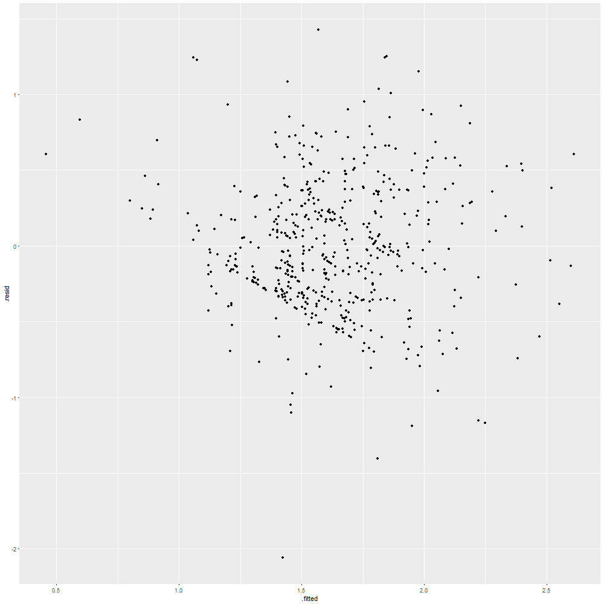
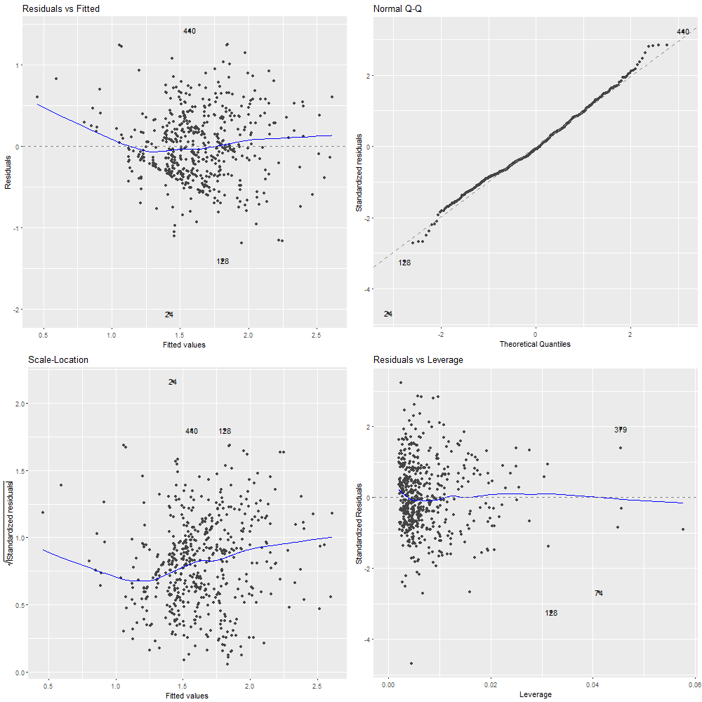

# Notas Luis Enrique Ramos Alvarez

## Notas Mayo 04, 2018

El día de hoy replicamos la tarea 14.4 y 14.5.1

### Ejercicio 14.4.

De la base de Wooldrige wage.xls extraemos las variables wage, educ, exper, tenure:

    wage = matrix(data$wage)
    educ = matrix(data$educ)
    exper = matrix(data$exper)
    tenure = matrix(data$tenure)
    
Y las concatenamos en una sola llamaba "X":

    lwage = log(wage)

    n = nrow(wage)

    unos = matrix(1, nrow = n, ncol=1) # Vector de unos 

    X = matrix(c(unos, educ, exper, tenure),n)

Después, con la función melt(), acomodamos las variables diferentes de lwage a un lado de esta variable con sus valores.
    
    data2 = melt(data, id.vars='lwage')
    
**Es importante revisar antes la relación de las variables pues se puede generar una regresión lineal sin que exista relación en las variables.**

Realizamos la correlación:

    > reg0 = lm(lwage ~ educ + exper + tenure)
    > reg0

    Call:
    lm(formula = lwage ~ educ + exper + tenure)

    Coefficients:
    (Intercept)         educ        exper       tenure  
       0.284360     0.092029     0.004121     0.022067 
       
El cambio en una unidad de cualquier variable impacta en (100bi)% el salario.
Los cambios en esta regresión no son causales. Sólo es una interpretación de los datos observados.
Correlación no implica causalidad. La causalidad viene generalmente por cómo se obtienen los datos.

Después, revisamos que los residuales sean normales.

    > gvlma(reg0)

    Call:
    lm(formula = lwage ~ educ + exper + tenure)

    Coefficients:
    (Intercept)         educ        exper       tenure  
       0.284360     0.092029     0.004121     0.022067  

    ASSESSMENT OF THE LINEAR MODEL ASSUMPTIONS
    USING THE GLOBAL TEST ON 4 DEGREES-OF-FREEDOM:
    Level of Significance =  0.05 

    Call:
     gvlma(x = reg0) 

                          Value   p-value                   Decision
    Global Stat        33.39687 9.906e-07 Assumptions NOT satisfied!
    Skewness            0.03952 8.424e-01    Assumptions acceptable.
    Kurtosis           20.90171 4.835e-06 Assumptions NOT satisfied!
    Link Function       6.72841 9.489e-03 Assumptions NOT satisfied!
    Heteroscedasticity  5.72723 1.670e-02 Assumptions NOT satisfied!

Por otro lado, revisamos la varianza de los residuales de la regresión.
    
    varu = var(reg0$residuals)

Después, realizamos las pruebas de hipótesis.

    betagorro = matrix(c(reg0$coefficients[1],reg0$coefficients[2],reg0$coefficients[3],reg0$coefficients[4]),4) #Coeficientes estimados

Extraemos cada coeficiente.

    b0 = betagorro[1]
    b1 = betagorro[2]
    b2 = betagorro[3]
    b3 = betagorro[4]

Hipotesis nulas, para pruebas simples

    alpha1 = 0.05;
    alpha2 = 0.01;
    level1 = 1-(alpha1/2)
    level2 = 1-(alpha2/2)

    H0b2 = 0;
    H0b2text = "b2=0"  # Texto de de la hipótesis nula 

Estadisticos para pruebas simples

    t2 = (b2 - H0b2)/(sqrt(varu)*sqrt(solve(t(X)%*%X)[3,3])) ##OJO [3,3]
    
Para validar las hipótesis:

    > if(abs(t2) > qt(level1,gl)){sprintf("Se rechaza H0: %s con %s de nivel de significancia", H0b2text, alpha1)} else {
    +   sprintf("Se acepta H0: %s con %s de nivel de significancia", H0b2text, alpha1)
    + }
    [1] "Se acepta H0: b2=0 con 0.05 de nivel de significancia"
    > 
    > 
    > if(abs(t2) > qt(level2,gl)){sprintf("Se rechaza H0: %s con %s de nivel de significancia", H0b2text, alpha2)} else {
    +   sprintf("Se acepta H0: %s con %s de nivel de significancia", H0b2text, alpha2)
    + }
    [1] "Se acepta H0: b2=0 con 0.01 de nivel de significancia"
    