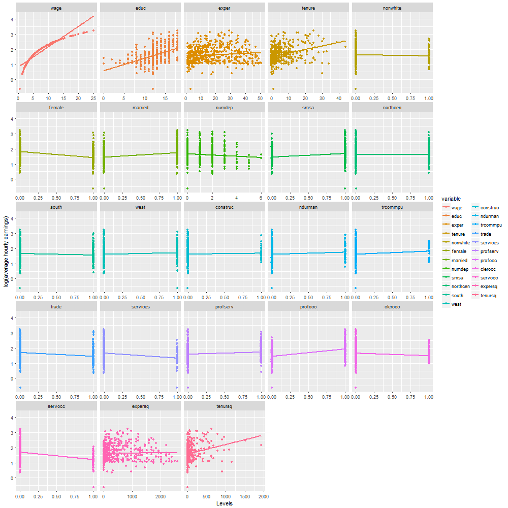

# Notas Luis Enrique Ramos Alvarez

## Notas Mayo 04, 2018

El día de hoy replicamos la tarea 14.4 y 14.5.1

### Ejercicio 14.4.

De la base de Wooldrige wage.xls extraemos las variables wage, educ, exper, tenure:

    wage = matrix(data$wage)
    educ = matrix(data$educ)
    exper = matrix(data$exper)
    tenure = matrix(data$tenure)
    
Y las concatenamos en una sola llamaba "X":

    lwage = log(wage)

    n = nrow(wage)

    unos = matrix(1, nrow = n, ncol=1) # Vector de unos 

    X = matrix(c(unos, educ, exper, tenure),n)

Después, con la función melt(), acomodamos las variables diferentes de lwage a un lado de esta variable con sus valores.
    
    data2 = melt(data, id.vars='lwage')
    
**Es importante revisar antes la relación de las variables pues se puede generar una regresión lineal sin que exista relación en las variables.**

#### Histogramas

Podemos gráficar historgamas con el código **"hist()"**, así como darle formato.

**Ejemplo:**

    lines(density(Journals$citeprice), col = 620)

    lines(density(Journals$citeprice), col = 2) # Rojo
    lines(density(Journals$citeprice), col = 3) # Verde
    lines(density(Journals$citeprice), col = 4) # Azúl
    lines(density(Journals$citeprice), col = 5) # Verde agua
    lines(density(Journals$citeprice), col = 6) # Rosa mexicano
    lines(density(Journals$citeprice), col = 7) # Amarillo 
    lines(density(Journals$citeprice), col = 8) # Gris

