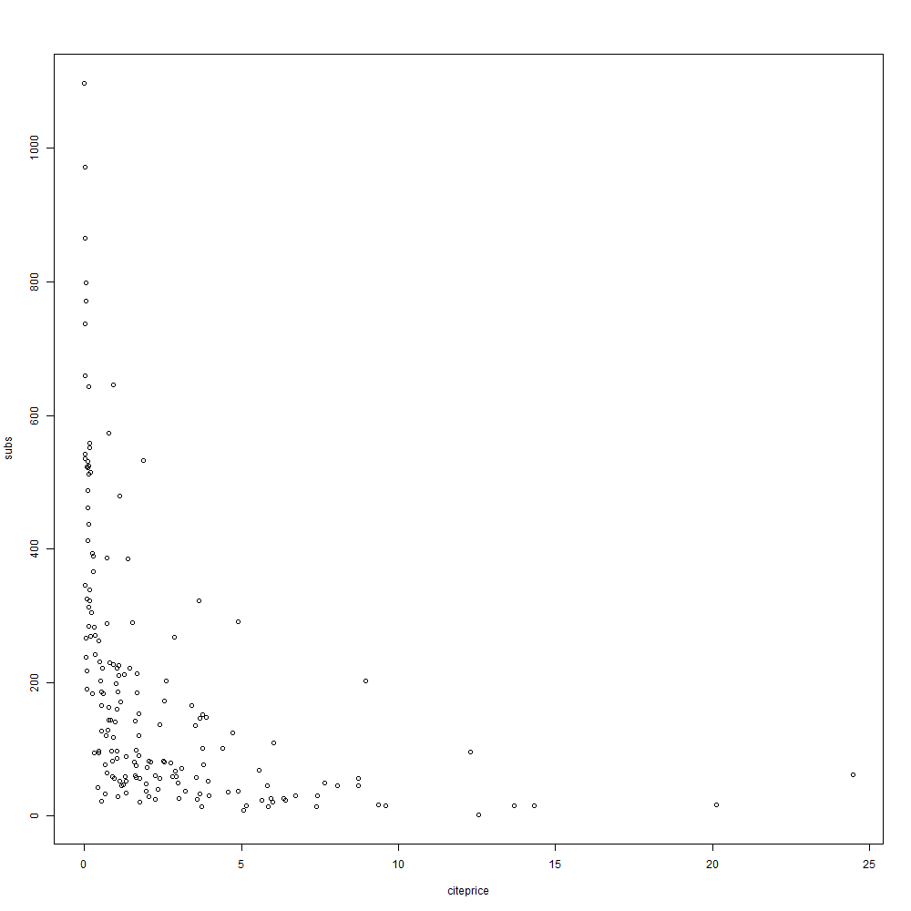

# Notas Luis Enrique Ramos Alvarez

## Notas Marzo 23, 2018

### Fijación de directorio.

En la primera parte de la sesión, confirmamos el directorio y lo fijamos nuevamente.
    
    > setwd("C:/Users/LuisEnrique/Documents/Maestría Colmex/Econometría I/Laboratorio")
    > getwd()
[1] "C:/Users/LuisEnrique/Documents/Maestría Colmex/Econometría I/Laboratorio"

### Data Frame.

#### Operadores racionales.

Instalamos el paquete **"AER"** con el código: **"install.packages("AER")"**, después cargamos esta librería con **"library("AER")"**. Si no cargamos la libreria no la podemos utilizar.
Después, cargamos la base de datos "Journals".

Utilizamos la función **"summary()"** para obtener un resumen general de la base de datos.

**Ejemplo:**

    > summary(Journals)
        title                           publisher  society       price            pages       
     Length:180         Elsevier             :42   no :164   Min.   :  20.0   Min.   : 167.0  
     Class :character   Blackwell            :26   yes: 16   1st Qu.: 134.5   1st Qu.: 548.8  
     Mode  :character   Kluwer               :16             Median : 282.0   Median : 693.0  
                        Springer             :10             Mean   : 417.7   Mean   : 827.7  
                        Academic Press       : 9             3rd Qu.: 540.8   3rd Qu.: 974.2  
                        Univ of Chicago Press: 7             Max.   :2120.0   Max.   :2632.0  
                        (Other)              :70                                              
         charpp       citations        foundingyear       subs                       field   
     Min.   :1782   Min.   :  21.00   Min.   :1844   Min.   :   2.0   General           :40  
     1st Qu.:2715   1st Qu.:  97.75   1st Qu.:1963   1st Qu.:  52.0   Specialized       :14  
     Median :3010   Median : 262.50   Median :1973   Median : 122.5   Public Finance    :12  
     Mean   :3233   Mean   : 647.06   Mean   :1967   Mean   : 196.9   Development       :11  
     3rd Qu.:3477   3rd Qu.: 656.00   3rd Qu.:1982   3rd Qu.: 268.2   Finance           :11  
     Max.   :6859   Max.   :8999.00   Max.   :1996   Max.   :1098.0   Urban and Regional: 8  
                                                                      (Other)           :84  
       citeprice        
     Min.   : 0.005223  
     1st Qu.: 0.464495  
     Median : 1.320513  
     Mean   : 2.548455  
     3rd Qu.: 3.440171  
     Max.   :24.459459
     
La función **"Head()"** regresa los primeros elementos de un dataframe.

**Ejemplo:**

    > head(Journals)
                                                         title              publisher society price
    APEL                     Asian-Pacific Economic Literature              Blackwell      no   123
    SAJoEH           South African Journal of Economic History So Afr ec history assn      no    20
    CE                                 Computational Economics                 Kluwer      no   443
    MEPiTE MOCT-MOST Economic Policy in Transitional Economics                 Kluwer      no   276
    JoSE                            Journal of Socio-Economics               Elsevier      no   295
    LabEc                                     Labour Economics               Elsevier      no   344
           pages charpp citations foundingyear subs             field  citeprice
    APEL     440   3822        21         1986   14           General  5.8571429
    SAJoEH   309   1782        22         1986   59  Economic History  0.9090909
    CE       567   2924        22         1987   17       Specialized 20.1363636
    MEPiTE   520   3234        22         1991    2      Area Studies 12.5454545
    JoSE     791   3024        24         1972   96 Interdisciplinary 12.2916667
    LabEc    609   2967        24         1994   15             Labor 14.3333333
    > # Head() regresa los primeros elementos de un dataframe
    > head(Journals)
                                                         title              publisher society price
    APEL                     Asian-Pacific Economic Literature              Blackwell      no   123
    SAJoEH           South African Journal of Economic History So Afr ec history assn      no    20
    CE                                 Computational Economics                 Kluwer      no   443
    MEPiTE MOCT-MOST Economic Policy in Transitional Economics                 Kluwer      no   276
    JoSE                            Journal of Socio-Economics               Elsevier      no   295
    LabEc                                     Labour Economics               Elsevier      no   344
           pages charpp citations foundingyear subs             field  citeprice
    APEL     440   3822        21         1986   14           General  5.8571429
    SAJoEH   309   1782        22         1986   59  Economic History  0.9090909
    CE       567   2924        22         1987   17       Specialized 20.1363636
    MEPiTE   520   3234        22         1991    2      Area Studies 12.5454545
    JoSE     791   3024        24         1972   96 Interdisciplinary 12.2916667
    LabEc    609   2967        24         1994   15             Labor 14.3333333

Por otro lado, la función "tail(Journals)" regresa los últimos elementos de un dataframe.

**Ejemplo:**

    > tail(Journals)
                                                      title             publisher society price pages
    JASA    Journal of the American Statistical Association  Am. Statistical Assn     yes   310  1260
    JoFi                                 Journal of Finance      Am. Finance Assn     yes   226  2272
    QJoE                     Quarterly Journal of Economics             MIT press      no   148  1467
    JoPolEc                    Journal of Political Economy Univ of Chicago Press      no   159  1669
    Ecnmt                                      Econometrica             Blackwell     yes   178  1482
    AER                            American Economic Review            Am Ec Assn     yes    47  1867
            charpp citations foundingyear subs        field   citeprice
    JASA      5664      2800         1971  487 Econometrics 0.110714286
    JoFi      3036      3791         1945  799      Finance 0.059614877
    QJoE      2184      4138         1886  660      General 0.035766071
    JoPolEc   2640      6697         1892  737      General 0.023741974
    Ecnmt     2992      7943         1932  346      General 0.022409669
    AER       3900      8999         1911 1098      General 0.005222803
    
Para poder ver la base de datos podemos sólo ingresar la nombre de la base:

**Ejemmplo:**

    > Journals
    
Sin embargo, para poder acceder a una variable de la base de datos necesitamos el código **"Journals$publisher"**.

**Ejemplo:**

    > Journals$publisher
      [1] Blackwell                   So Afr ec history assn      Kluwer                     
      [4] Kluwer                      Elsevier                    Elsevier                   
      [7] Cambridge Univ Pres         Elsevier                    Kluwer                     
     [10] Blackwell                   Kluwer                      MIT                        
     [13] Blackwell                   Wiley                       Elsevier                   
     [16] Springer                    MIT Press                   Intnl Atlantic Ec. Soc.    
     [19] Sage                        Elsevier                    Elsevier                   
     [22] Blackwell                   Elsevier                    Blackwell                  
     [25] Elsevier                    Kluwer                      Routledge                  
     [28] Brookings Inst.             Springer                    Springer                   
     [31] Springer                    MIT                         University of Toronto Press
     [34] Inst of Devel Econ          Academic Press              Elsevier                   
     [37] Springer                    Springer                    Dekker                     
     [40] Elsevier                    Elsevier                    Routledge                  
     [43] Elsevier                    Blackwell                   Kluwer                     
     [46] Kluwer                      ANU Press                   Springer                   
     [49] Oxford Univ Press           Heldref                     Academic Press             
     [52] Cambridge Univ Pres         Academic Press              Elsevier                   
     [55] Oxford Univ Press           Kluwer                      Elsevier                   
     [58] Kluwer                      LSU Press                   Blackwell                  
     [61] Sage                        Blackwell                   Elsevier                   
     [64] Oxford Univ Press           Carfax                      Mohr Siebeck               
     [67] Blackwell                   Blackwell                   Kluwer                     
     [70] Elsevier                    M.E Sharpe                  Blackwell                  
     [73] Elsevier                    Elsevier                    Duke Univ Press            
     [76] Ec. Society of Australia    Kluwer                      Int Assn for Res in I & W  
     [79] Am. Risk & Ins. Assn        Blackwell                   Agric. Econ. Society       
     [82] Elsevier                    George Mason Univ           Kluwer                     
     [85] Springer                    Academic Press              Elsevier                   
     [88] Elsevier                    Helbing & Lichtenhahn       Academic Press             
     [91] Springer                    LSE and Univ of Bath        Blackwell                  
     [94] Blackwell                   Wiley                       Mohr Siebeck               
     [97] Elsevier                    Wiley                       Elsevier                   
    [100] Blackwell                   Oxford Univ Press           Assn Ev. Economics         
    [103] Elsevier                    Springer                    Kluwer                     
    [106] Univ Wash Press             Frank Cass                  Cambridge Univ Pres        
    [109] Blackwell                   Elsevier                    Academic Press             
    [112] Wiley                       Elsevier                    Elsevier                   
    [115] Carfax                      Population Council          Routledge                  
    [118] Georgia State Univ          Blackwell                   Elsevier                   
    [121] National Tax Assn.          Carfax                      Wiley                      
    [124] Blackwell                   Oxford Univ. Press          Blackwell                  
    [127] Kluwer                      Routledge                   Oxford Univ. Press         
    [130] Univ of Chicago Press       Elsevier                    Blackwell                  
    [133] Elsevier                    Southern Econ. Assn         Blackwell                  
    [136] Kluwer                      Pop Assn America            Oxford Univ Press          
    [139] Elsevier                    Univ of Chicago Press       Elsevier                   
    [142] Univ of Wisconsin Press     Univ of Chicago Press       Cambridge Univ Pres        
    [145] Academic Press              Blackwell                   Ohio State Univ. Press     
    [148] Elsevier                    Kluwer                      Elsevier                   
    [151] Elsevier                    Elsevier                    Am Stat Assn               
    [154] RAND                        Univ of Chicago Press       Univ of Wisconsin Press    
    [157] Blackwell                   Academic Press              Elsevier                   
    [160] Elsevier                    Elsevier                    Am Ec Assn                 
    [163] Univ of Chicago Press       Am Ec Assn                  Am. Ag. Econ Assn          
    [166] Elsevier                    Inst for OR and MS          MIT press                  
    [169] Blackwell                   Elsevier                    Academic Press             
    [172] Blackwell                   Elsevier                    Univ of Chicago Press      
    [175] Am. Statistical Assn        Am. Finance Assn            MIT press                  
    [178] Univ of Chicago Press       Blackwell                   Am Ec Assn                 
    52 Levels: ANU Press Academic Press Agric. Econ. Society Am Ec Assn ... Wiley
    
Podemos hacer operaciones extrayendo variables de la base de datos con **"$"**, con la cual incluye la nueva variable a la base de datos.

**Ejemplo:**

    > Journals$citeprice <- Journals$price/Journals$citations
    
Se sugiere que se mantenga intacta la base de datos original.

En este sentido, una de las funciones que podemos utilizar para poder hacer uso de las variables de la base de datos son:

    attach(Journals)   #mantener los datos como variables.
    
    detach(Journals)    # Ya no podemos acceder a las variables.

Sin embargo, lo recomendable es no utilizar **"attach()"**, pues se pueden mezclar las variables.

#### Gráficas.

Para generar las gráficas de puntos utilizamos "plot()".

**Ejempo:**
    
    plot(log(subs), log(citeprice))

Para exportar las gráficas a 

A. PDF:

    > pdf("testPDF.pdf", height = 5, width = 6)
    > plot(subs ~ citeprice, data = Journals)
    > dev.off()

B. jpeg:

    > jpeg(filename = "testJPG.jpg",
    +      width = 1000, height = 1000, units = "px")     #"px": pixeles
    > plot(subs ~ citeprice, data = Journals)
    > dev.off()
    
C. png:

    > png(filename = "testPNG.png",
    +     width = 1000, height = 1000, units = "px")
    > plot(subs ~ citeprice, data = Journals)
    > dev.off()
    

#### Histogramas

Podemos gráficar historgamas con el código **"hist()"**, así como darle formato.

**Ejemplo:**

    lines(density(Journals$citeprice), col = 620)

    lines(density(Journals$citeprice), col = 2) # Rojo
    lines(density(Journals$citeprice), col = 3) # Verde
    lines(density(Journals$citeprice), col = 4) # Azúl
    lines(density(Journals$citeprice), col = 5) # Verde agua
    lines(density(Journals$citeprice), col = 6) # Rosa mexicano
    lines(density(Journals$citeprice), col = 7) # Amarillo 
    lines(density(Journals$citeprice), col = 8) # Gris

