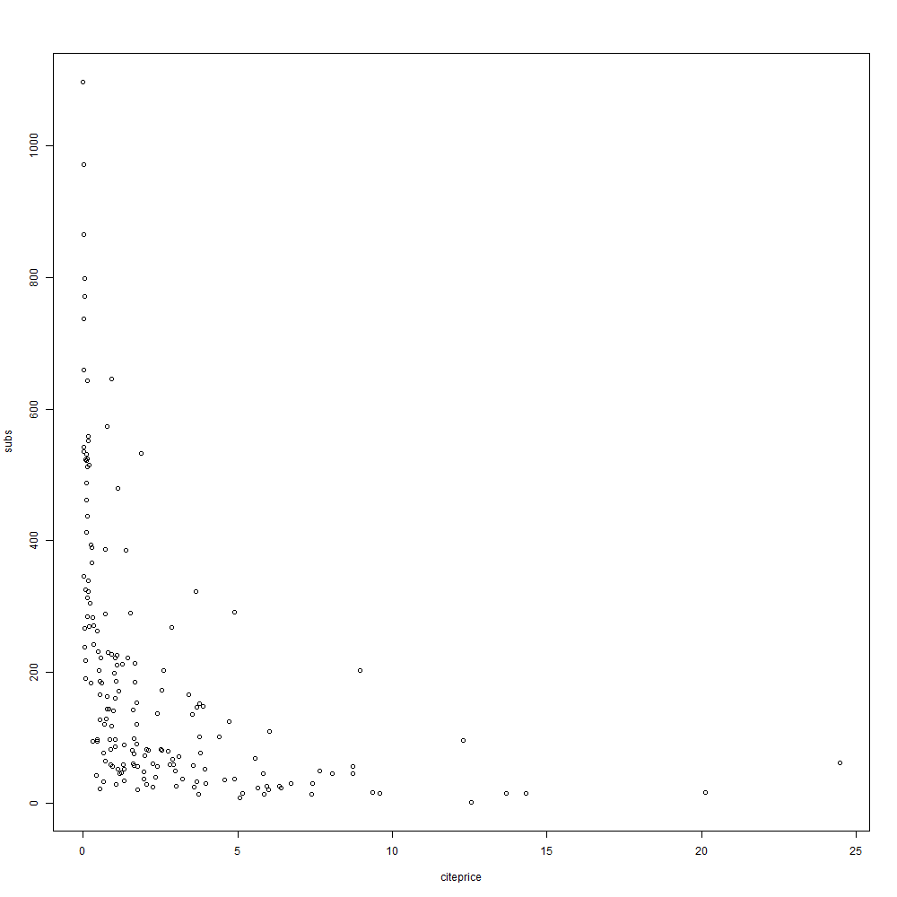

# Sesión 3 
## Índice
### Bases de datos
### Gráficos

# Dataframes & plots

necesitamos la libreria AER para poder hacer uso de una base de datos existente en algún sitio 
     
    install.packages("AER")
    library("AER")

# Bases de datos
Cargando la base de datos 
    
    data("Journals")

La variable summary nos da un resumen del input
         
         summary(Journals)

Creamos una matriz para comparar con un dataframe
        
        JOURNAL = matrix(1:100)

Head() regresa los primeros elementos de un dataframe
         
         head(Journals)

Tail regresa los últimos elementos de un dataframe
         
         tail(Journals)

Creamos una variable que diga el precio por cada cita
         
         Journals$citeprice <- Journals$price/Journals$citations

attach() permite acceder a los elementos de un dataframe "directamente"
         
         attach(Journals)

# Gráficos
plot() es la función básica para gráficos en R
         
         plot(log(subs), log(citeprice))

rug() añade barras para indicar sobre los ejes en donde se encuentra una observación
        
        rug(log(subs)  
        rug(log(citeprice), side = 2)

detach() cierra el "fácil acceso" al dataframe
          
          detach(Journals)

Es recomendable NO usar attach y detach.

Para plotear lo mismo sin tener que "attachear" el dataframe:
         
         plot(log(subs) ~ log(citeprice), data = Journals)

Veamos la diferencia de plotear en niveles
         
         plot(subs ~ citeprice, data = Journals)

## Exportando un gráfico a PDF
          pdf("testPDF.pdf", height = 5, width = 6)
          plot(subs ~ citeprice, data = Journals)
          dev.off()

## Gráficos en JPG y PNG

### Imagen en JPG
     
     jpeg(filename = "testJPG.jpg",
          width = 1000, height = 1000, units = "px")
     plot(subs ~ citeprice, data = Journals)
     dev.off()

### Imagén en PNG
   
        png(filename = "testPNG.png",
              width = 1000, height = 1000, units = "px")
          plot(subs ~ citeprice, data = Journals)
          dev.off()

# Histógramas
     
     hist(Journals$citeprice, freq = FALSE)
Lines es un gráfico de línea, en este caso añade la apariencia de la densidad
     
     lines(density(Journals$citeprice), col = 1)
 col indica el color, veamos otros
     
     lines(density(Journals$citeprice), col = 2) # Rojo
     lines(density(Journals$citeprice), col = 3) # Verde
     lines(density(Journals$citeprice), col = 4) # Azúl
     lines(density(Journals$citeprice), col = 5) # Verde agua
     lines(density(Journals$citeprice), col = 6) # Rosa mexicano
     lines(density(Journals$citeprice), col = 7) # Amarillo 
     lines(density(Journals$citeprice), col = 8) # Gris

 Exportando el histograma a PDF

     pdf("histoPDF.pdf", height = 5, width = 6)
     hist(Journals$citeprice, freq = FALSE)
     lines(density(Journals$citeprice), col = 2) # Rojo
     dev.off()
     

Mejorando las gráficas
    
    hist(Journals$citeprice, 
          freq = FALSE,
          border = NULL,
          main = paste("Distribución de el costo por cita"),
          xlab = "USD por cita", 
          ylab = "Densidad")
     lines(density(Journals$citeprice), col = 2) # Rojo

Exportando nuevamente
     
     pdf("histoPDFv2.pdf", height = 5, width = 6)
     hist(Journals$citeprice, 
          freq = FALSE,
          border = NULL,
          main = paste("Distribución del costo por cita"),
          xlab = "USD por cita", 
          ylab = "Densidad")
     lines(density(Journals$citeprice), col = 2) # Rojo
     dev.off()

Distribución de frecuencias
     
     hist(Journals$citeprice)
     lines(density(Journals$citeprice), col = 2) # Rojo

 Resumen de la variable
  
     summary(Journals$publisher)

Definiendo una variable de a base

     tab <- table(Journals$publisher)
     prop.table(tab)

# Gráfico de barras
     
     barplot(tab)

# Gráfico de pastel
     pie(tab)

Reordenando el database para mejorar las visualizaciones

          sortedtab = sort(tab, decreasing = TRUE)
          otros = sum(sortedtab[7:52])
          main = sortedtab[1:6]

     Editoriales = append(main,otros)
     Editoriales

Eso hace a nuestros plots mucho más entendibles

     barplot(Editoriales)

     pie(Editoriales, main="Mayores editoriales de Journals")

Exportando los plots
     
     pdf("piePDF.pdf", height = 5, width = 6)
     pie(Editoriales, main="Mayores editoriales de Journals")
     dev.off()

# Ejemplo de dataframe desde cero

 Obtenemos una muestra aleatoria normal

     library(MASS)

     n = 30 # Tamaño de la muestra

     mx = c(4,2,0,0,2) # Vector de medias de X 
     sx = matrix(c(4,-1,0,0,0,
                   -1,1,0,0,0,
                   0,0,1,0,0,
                   0,0,0,9,2,
                   0,0,0,2,4),5) # Varianza de X

     Xsample = mvrnorm(n,mx,sx) # Muestra aleatoria de x1 y x2
     Xsample

Creamos las etiquetas para nombrar a nuestras "variables"
     
     lbls <- c("US", "UK", "Australia", "Germany", "France")

 Aplicamos las etiquetas a las columnas de la matriz aleatoria
     
     colnames(Xsample) = lbls

Creamos un índice para poder graficar
    
    index = matrix(1:30)

Unimos las matrices en una sola
     
     datos = cbind(index,Xsample)

 Convertimos la matriz en dataframe

     datosF = as.data.frame(datos)

 Usaremos nuestro dataframe ficticio para generar plots

 Creamos un vector de colores 
     
     plot_colors <- c("blue","red","forestgreen")

Creamos el gráfico base
     
     plot(datosF$US, type="o", col=plot_colors[1], ylim=c(-2,13), ylab = "Crecimiento", xlab = "Periodos")

Creamos otros gráficos encima del gráfico base

     lines(datosF$UK, type="o", pch=2, lty=5, col=plot_colors[2])
     lines(datosF$Australia, type="o", pch=23, lty=3, col=plot_colors[3])

Asignamos el título al gráfico

     title(main="Países", col.main="blue", font.main=4)

Creamos un recuadro para referenciar a las líneas graficadas

     legend(25, 13, c("UK","Australia", "US"), c("blue","red","forestgreen"),cex=0.5)
